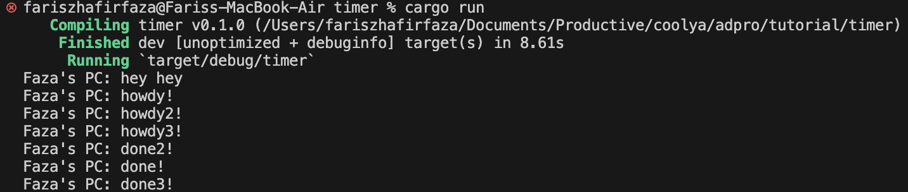

Tutorial Timer

- 1.2 Understanding how it works

    

    From observing the output, it can be understood that the async function runs independently of the main function. Consequently, "hey hey" could potentially be output before "howdy!" and "done!" because "hey hey" is outside the async function. The program proceeds to execute println!("hey hey"); while the async function is still waiting for the result of the future.

- 1.3 Multiple Spawn and removing drop

    
    
    

    From the provided output, it's clear that the async tasks are executed concurrently. The execution order can vary due to the nature of asynchronous programming. In this case, "hey hey" is consistently printed first because it's outside of the async blocks and is executed immediately after spawning the tasks. However, the order of "howdy!" and "done!" messages from each async block can differ due to concurrency. The concurrent execution allows for interleaving of the async tasks. Sometimes, one task may complete before another, leading to variations in the order of "howdy!" and "done!" messages. This behavior is expected in asynchronous programming where tasks can run independently and concurrently.

